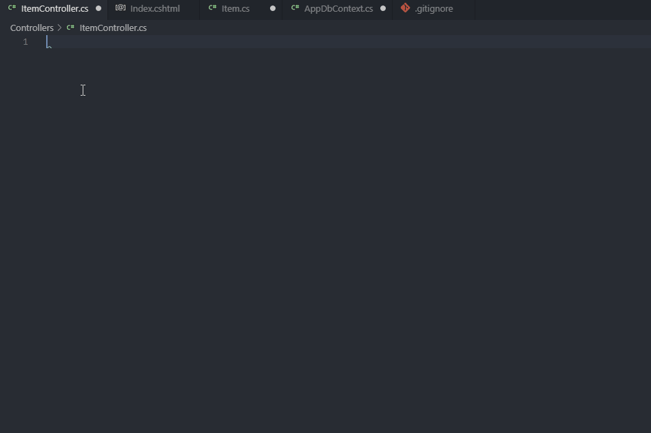

# .NET Core Snippet Pack

*Created with https://vscodesnippetgenerator.azurewebsites.net/ (https://github.com/AdrianWilczynski/VSCodeSnippetGenerator)*

A pack of around **120** snippets for .NET Core.

## C\# (csharp)
| Prefix                          | Renders                                                                |
| ------------------------------- | ---------------------------------------------------------------------- |
| class-namespace                 | Class and Namespace with some common Usings                            |
| class-static-namespace          | Static Class and Namespace                                             |
| interface-namespace             | Interface and Namespace                                                |
| enum-namespace                  | Enum and Namespace                                                     |
| class-static                    | Static Class                                                           |
| namespace-guess                 | Namespace based on directory structure*                                |
| method(-async)                  | Method                                                                 |
| method-exp(-async)              | Expression Bodied Method                                               |
| field                           | Field                                                                  |
| const                           | Constant Field                                                         |
| prop-exp                        | Expression Bodied Property                                             |
| propfull-exp                    | Expression Bodied Property and Backing Field                           |
| propp                           | Property with changeable Access Modifier                               |
| foreach-index                   | Foreach with index                                                     |
| for-full                        | Fully modifiable for loop                                              |
| switch-exp                      | Switch Expression                                                      |
| throw                           | Throw Exception                                                        |
| _                               | Underscored name based on preceding type                               |
| c                               | CamelCased name based on preceding type                                |
| p                               | PascalCased name based on preceding type                               |
| filename                        | Filename without extension                                             |

\* For namespace guessing to work your project's root folder must be in one of the following directories: repos, src, test, tests, projects, desktop. Folder name matching is case insensitive.

### Preprocessor Directives
| Prefix                          | Renders                                                                |
| ------------------------------- | ---------------------------------------------------------------------- |
| warning-disable                 | #pragma warning disable directive                                      |
| warning-restore                 | #pragma warning restore directive                                      |

### Design Patterns
| Prefix                            | Renders                                                              |
| --------------------------------- | -------------------------------------------------------------------- |
| dp-uow                            | Unit of Work                                                         |
| dp-uow-interface                  | Unit of Work Interface                                               |
| dp-repo                           | Repository                                                           |
| dp-repo-derived                   | Derived Repository                                                   |
| dp-repo-standalone                | Standalone Repository                                                |
| dp-repo-interface                 | Repository Interface                                                 |
| dp-repo-interface-standalone      | Standalone Repository Interface                                      |
| dp-repo-base                      | Base Repository                                                      |
| dp-repo-base-interface            | Base Repository Interface                                            |
| dp-repo-interface-derived         | Derived Repository Interface                                         |

### ASP.NET Core
| Prefix                            | Renders                                                              |
| --------------------------------- | -------------------------------------------------------------------- |
| asp-mvc-controller                | MVC Controller                                                       |
| asp-api-controller                | API Controller                                                       |
| asp-page-model                    | Razor Page Model                                                     |
| asp-view-component                | View Component Class                                                 |
| asp-action-filter                 | Action Filter                                                        |
| asp-action(-async)                | MVC Action                                                           |
| asp-action-get(-async)            | API Action GET                                                       |
| asp-action-get-enumerable(-async) | API Action GET Enumerable                                            |
| asp-action-post(-async)           | API Action POST                                                      |
| asp-action-put(-async)            | API Action PUT                                                       |
| asp-action-delete(-async)         | API Action DELETE                                                    |
| asp-page-handler(-async)          | Razor Page Handler                                                   |
| asp-prop-bind                     | Property with BindProperty attribute                                 |
| asp-model-state-guard             | ModelState Guard Clause                                              |
| asp-add-db-context                | AddDbContext() Call                                                  |

### Entity Framework Core
| Prefix                          | Renders                                                                |
| ------------------------------- | ---------------------------------------------------------------------- |
| ef-db-context                   | DbContext                                                              |
| ef-db-set                       | DbSet                                                                  |
| ef-on-model-creating            | OnModelCreating Method                                                 |

### SignalR
| Prefix                          | Renders                                                                |
| ------------------------------- | ---------------------------------------------------------------------- |
| sr-hub                          | Hub                                                                    |
| sr-on-connected-async           | OnConnectedAsync Method                                                |
| sr-on-disconnected-async        | OnDisconnectedAsync Method                                             |

### AutoMapper
| Prefix                          | Renders                                                                |
| ------------------------------- | ---------------------------------------------------------------------- |
| am-profile                      | Profile                                                                |
| am-type-converter               | Type Converter                                                         |

### xUnit
| Prefix                          | Renders                                                                |
| ------------------------------- | ---------------------------------------------------------------------- |
| xu-class                        | Test Class                                                             |
| xu-fact                         | Fact Method                                                            |

### dotnet-script
| Prefix                          | Renders                                                                |
| ------------------------------- | ---------------------------------------------------------------------- |
| ds-nuget-reference              | NuGet Package Reference                                                |
| ds-script-load                  | Script Reference                                                       |
| ds-path                         | GetScriptFolder Method                                                 |
| ds-nuget-references-common      | Common NuGet Package References                                        |

## Razor (html) 
| Prefix                          | Renders                                                                |
| ------------------------------- | ---------------------------------------------------------------------- |
| asp-view                        | View Template                                                          |
| asp-razor-page                  | Page Template                                                          |
| asp-layout                      | _Layout Template                                                       |
| asp-view-start                  | _ViewStart Template                                                    |
| asp-view-imports                | _ViewImports Template                                                  |
| asp-form-group                  | Form Group - input field, label and validation span                    |
| asp-form-group-bootstrap        | Form Group with Bootstrap's classes                                    |
| asp-select-form-group           | Select Form Group                                                      |
| asp-textarea-form-group         | Textarea Form Group                                                    |
| asp-functions                   | @functions Block                                                       |
| asp-if                          | If                                                                     |
| asp-if-authenticated            | If with IsAuthenticated check                                          |
| asp-section                     | Section                                                                |
| asp-foreach                     | Foreach                                                                |

### Tag Helpers
| Prefix                          | Renders                                                                |
| ------------------------------- | ---------------------------------------------------------------------- |
| asp-for                         | asp-for Tag Helper                                                     |
| asp-action                      | asp-action Tag Helper                                                  |
| asp-controller                  | asp-controller Tag Helper                                              |
| asp-area                        | asp-area Tag Helper                                                    |
| asp-route                       | asp-route Tag Helper                                                   |
| asp-page                        | asp-page Tag Helper                                                    |
| asp-page-handler                | asp-page-handler Tag Helper                                            |
| asp-validation-for              | asp-validation-for Tag Helper                                          |
| asp-validation-summary          | asp-validation-summary Tag Helper                                      |
| asp-route-...                   | asp-route-... Tag Helper                                               |
| asp-all-route-data              | asp-all-route-data Tag Helper                                          |
| asp-fragment                    | asp-fragment Tag Helper                                                |
| asp-protocol                    | asp-protocol Tag Helper                                                |
| asp-items                       | asp-items Tag Helper                                                   |
| asp-append-version              | asp-append-version Tag Helper                                          |
| asp-antiforgery                 | asp-antiforgery Tag Helper                                             |
| asp-host                        | asp-host Tag Helper                                                    |
| asp-src-include                 | asp-src-include Tag Helper                                             |
| asp-src-exclude                 | asp-src-exclude Tag Helper                                             |
| asp-partial                     | Partial View Tag Helper                                                |
| asp-view-component              | View Component Tag Helper                                              |
| asp-cache                       | Cache Tag Helper                                                       |
| asp-environment                 | Environment Tag Helper                                                 |

## csproj (xml, msbuild) 
| Prefix                           | Renders                                                               |
| -------------------------------- | --------------------------------------------------------------------- |
| csproj-user-secrets              | UserSecretsId Element                                                 |
| csproj-ruleset                   | CodeAnalysisRuleSet Element                                           |
| csproj-copy-to-publish           | Content Element with CopyToPublishDirectory Attribute                 |
| csproj-lang-version              | LangVersion Element                                                   |
| csproj-nullable                  | Nullable Element                                                      |
| csproj-exec-before-build         | Exec before Build                                                     |
| csproj-if-release                | Condition - if (not) Release                                          |

## appsettings (json) 
| Prefix                          | Renders                                                                |
| --------------------------------| ---------------------------------------------------------------------- |
| as-mssql-connection-string      | MS SQL LocalDB Connection String                                       |
| as-sqlite-connection-string     | SQLite Connection String                                               |

## .gitignore (ignore)

| Prefix                          | Renders                                                                |
| --------------------------------| ---------------------------------------------------------------------- |
| vs-gitignore                    | Visual Studio .gitignore (source: https://github.com/github/gitignore) |

## ruleset (plaintext) 

### Roslynator
| Prefix                          | Renders                                                                |
| --------------------------------| ---------------------------------------------------------------------- |
| roslynator-ruleset              | Rules for ASP.NET Core (disable RCS1090: Call 'ConfigureAwait(false)') |

## HTML (html) 

| Prefix                          | Renders                                                                |
| --------------------------------| ---------------------------------------------------------------------- |
| bootstrap-cdn                   | Link to Bootstrap & various themes*                                    |

\* Themes: 
- MDBootstrap (https://github.com/mdbootstrap/bootstrap-material-design), 
- Material Design for Bootstrap (https://github.com/FezVrasta/bootstrap-material-design),
- Bootswatch (https://github.com/thomaspark/bootswatch),
- HackerThemes (https://github.com/HackerThemes/theme-machine), 
- Tophat Themes (https://github.com/themesguide/top-hat) 
- Bootcatch (https://github.com/ajaymarathe/bootcatch-themes)

## JavaScript (javascript) 

### Webpack
| Prefix                          | Renders                                                                |
| --------------------------------| ---------------------------------------------------------------------- |
| asp-webpack                     | Simple Webpack Config for ASP.NET Core                                 |

## EditorConfig (properties) 

| Prefix                          | Renders                                                                |
| --------------------------------| ---------------------------------------------------------------------- |
| ec-underscored-field            | Underscored camel case field names Config                              |

## License (markdown, plaintext) 

| Prefix                          | Renders                                                                |
| --------------------------------| ---------------------------------------------------------------------- |
| license-mit                     | MIT License                                                            |